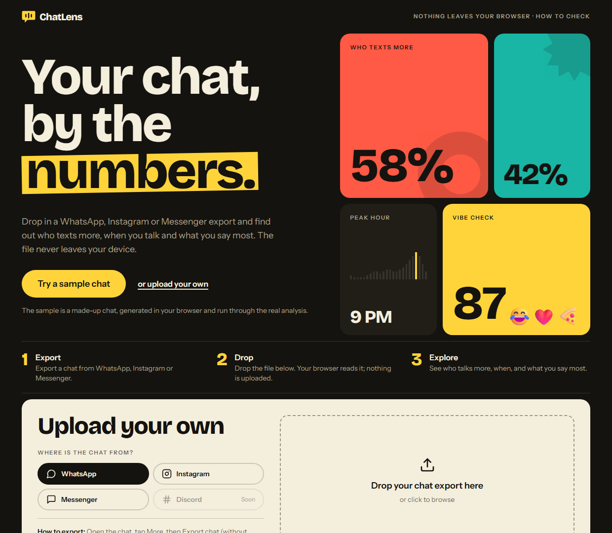
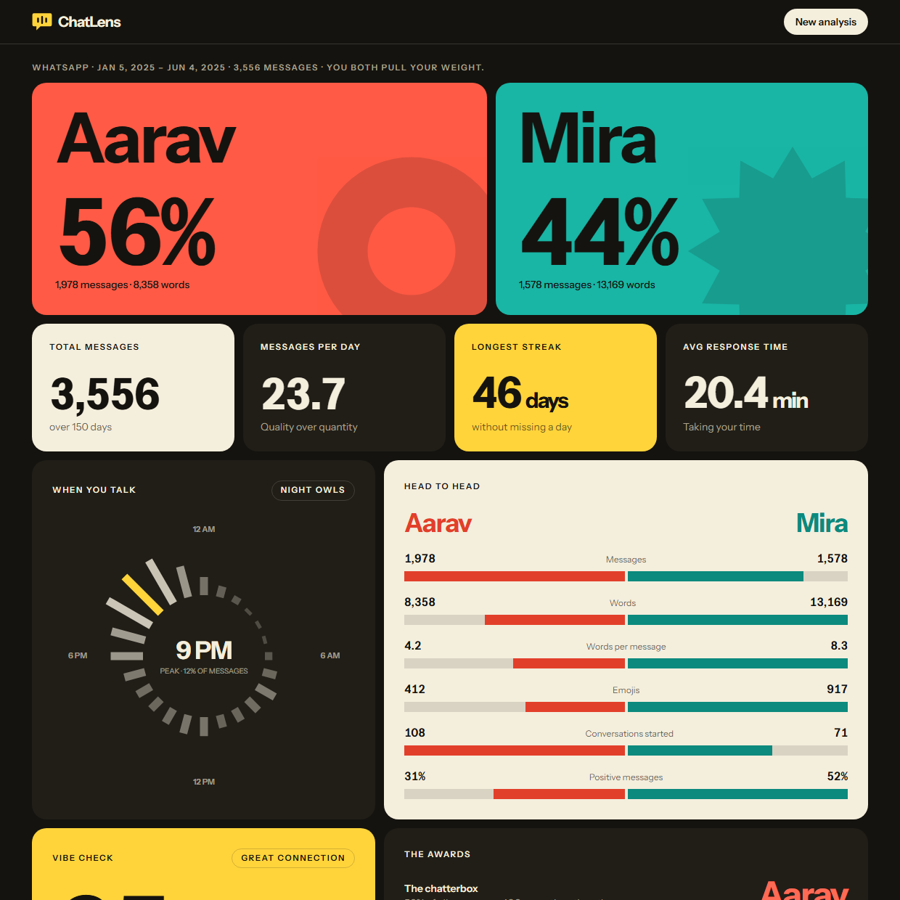

# ChatLens

ChatLens analyses a chat export from WhatsApp, Instagram or Messenger and shows who talks more, when you talk, how fast you reply, how long your streaks run and a few playful scores. All of the work happens in your browser. The site is static, has no backend, and your chat file is never uploaded anywhere.

Live demo: https://chat-lens-ivory.vercel.app
Sample analysis without uploading anything: https://chat-lens-ivory.vercel.app/?demo





## What it analyses

- Message, word and emoji counts per person, words per message, and who starts conversations (a message after a gap of more than 4 hours counts as a new conversation).
- Activity by hour of day, busiest day, and the longest run of consecutive days with messages.
- Average response time.
- Sentiment per person (positive, neutral, negative share of messages).
- Signature phrases (words and two-word pairs each person uses most) and top emojis.
- Call statistics, when the export contains calls (Instagram and Messenger).
- Light-hearted scores: a vibe check, a communication style label, an energy match based on peak hours, and a consistency score with a day-by-day heatmap.

## Privacy

- The app is a static Next.js site. There is no server code and no database.
- There are no analytics, trackers or third-party scripts.
- Nothing is stored. The chat is read into memory, analysed, and gone when you close or reload the tab. There is no localStorage, cookie or upload.
- The site sends a Content-Security-Policy with `connect-src 'none'`, so the browser itself refuses any fetch, XHR, WebSocket or beacon the page tries to make. It also sets `form-action 'none'` and `default-src 'self'`. The policy is in [`next.config.mjs`](next.config.mjs). It is applied to production builds only, because the dev server needs a WebSocket for hot reload.

You do not have to take this on trust:

1. Offline test: load the page, disconnect from the network, then analyse a chat. It works the same.
2. Network tab: open your browser's developer tools, go to Network, and analyse a chat. No request is made while or after you pick a file.
3. CSP header: in the Network tab, click the document request and read the `Content-Security-Policy` response header, or run `curl -I https://chat-lens-ivory.vercel.app`.

## Supported formats

| Platform | File | Notes |
| --- | --- | --- |
| WhatsApp | `.txt` export | Android style (`15/10/25, 14:17 - Name: text`) and iPhone style (`[10/15/25, 2:17:39 PM] Name: text`). Multi-line messages are joined; system notices and "media omitted" lines are skipped. |
| WhatsApp | `.json` | Accepted by the parser. |
| Instagram | `message_*.json` | Upload every `message_*.json` file from the chat folder; they are merged. |
| Messenger | `message_*.json` | Same as Instagram. |
| Discord | | Listed in the UI as coming soon. Not usable yet. |

At least 10 messages are needed to produce an analysis.

## How to export a chat

- WhatsApp: open the chat, tap the menu (More), choose Export chat, choose Without media, and save the `.txt` file.
- Instagram: Settings, then Accounts Center, then Your information and permissions, then Download your information. Choose the Messages data, select JSON as the format, and download. Unzip it and find the chat's folder under `messages/inbox/`.
- Messenger: Settings, then Accounts Center, then Your information and permissions, then Download your information. Choose Messages, select JSON, download, unzip, and find the chat's folder under `messages/inbox/`.

Menu names change from time to time; the in-app hint for each platform is the shortest version. For Instagram and Messenger, upload all `message_*.json` files in the chat folder, since long chats are split across several files.

## Run it

Requires Node.js 20 or newer.

```bash
npm install
npm run dev          # development server on http://localhost:3000
npm run build        # production build
npm run start        # serve the production build
npm run typecheck    # tsc --noEmit
npm run check        # parser self-check
```

`npm run check` runs `lib/process-chat.check.ts`, which feeds sample Android and iPhone WhatsApp exports through the parser and asserts on the result. The production build also fails on type errors.

## How it works

- Parsing (`lib/process-chat.ts`): each platform has a parser that turns the file into a flat list of `{ sender, content, timestamp }`. WhatsApp text is matched line by line with a regular expression that accepts both export styles and several date separators. Instagram and Messenger JSON is read from the `messages` array; call records are pulled out separately.
- Sentiment: a word list. Each message is lowercased and its words are checked against a positive list and a negative list (plus a few emoticons). More positive hits makes the message positive, more negative hits makes it negative, otherwise neutral.
- Streaks: messages are grouped by calendar day, and the longest run of consecutive days with at least one message is reported.
- Response time: for consecutive messages from different people, the gap is counted as a reply if it is under 60 minutes, and the average is taken. Only the first 2,000 messages are used.
- Signature phrases: words longer than two letters that are not stop words, plus adjacent word pairs, counted per person. Large chats are sampled (every 3rd, 5th or 10th message depending on size), and a phrase needs at least 3 occurrences.
- Scores: the vibe check combines message balance (30%), positive sentiment share (50%) and emoji use (up to 20%). The other labels come from simple thresholds on the same numbers.

## Limitations

- Sentiment is a word list. It does not understand context, sarcasm, slang it has not been given, or any language other than English.
- The scores and labels are for fun. They are not a measure of a relationship.
- Only the first two participants (the two with the most messages) are compared. In a group chat, everyone else is left out of the head-to-head views.
- Signature phrases are mostly single words, and sampling means counts are approximate on large chats.
- Response time ignores gaps of an hour or more and looks only at the start of the chat.
- Times are shown in your browser's time zone.
- Emoji counting uses fixed Unicode ranges and misses some newer emoji.

## Tech

Next.js 16, React 19, Tailwind CSS v4, lucide-react icons. Charts are drawn by hand in SVG and CSS, so there is no charting library.

## Licence

No licence has been chosen yet, so by default all rights are reserved.
